# Unmixing Diffusion for Self-Supervised Hyperspectral Image Denoising

Haijin Zeng 1 Jiezhang Cao 2\* Kai Zhang 3 Yongyong Chen 4 Hiep Luong 1 Wilfried Philips 1 1 IMEC-UGent 2 ETH Zurich 3 Nanjing University 4 Harbin Institute of Technology, Shenzhen {Haijin.Zeng, Hiep.Luong, Wilfried.Philips}@UGent.be, jiezhang.cao@vision.ee.ethz.ch

## Abstract

Hyperspectral images (HSIs) have extensive applications in various fields such as medicine, agriculture, and industry. Nevertheless, acquiring high signal-to-noise ratio HSI poses a challenge due to narrow-band spectral filtering. Consequently, the importance of HSI denoising is substantial, especially for snapshot hyperspectral imaging technology. While most previous HSI denoising methods are supervised, creating supervised training datasets for the diverse scenes, hyperspectral cameras, and scan parameters is impractical. In this work, we present Diff-Unmix, a self-supervised denoising method for HSI using diffusion denoising generative models. Specifically, Diff-Unmix addresses the challenge of recovering noisedegraded HSI through a fusion of Spectral Unmixing and conditional abundance generation. Firstly, it employs a learnable block-based spectral unmixing strategy, complemented by a pure transformer-based backbone. Then, we introduce a self-supervised generative diffusion network to enhance abundance maps from the spectral unmixing block. This network reconstructs noise-free Unmixing probability distributions, effectively mitigating noise-induced degradations within these components. Finally, the reconstructed HSI is reconstructed through unmixing reconstruction by blending the diffusion-adjusted abundance map with the spectral endmembers. Experimental results on both simulated and real-world noisy datasets show that Diff-Unmix achieves state-of-the-art performance.

## 1. Introduction

Hyperspectral images (HSIs) offer richer spectral information compared to RGB images, making them valuable for various applications such as face recognition [48, 49], vegetation detection [6], and medical diagnosis [54]. However, the substantial number of spectral bands in HSIs, combined with scanning designs [3] and narrow band spectral filtering, results in limited photon counts per band, making HSIs susceptible to noise [62]. This noise not only degrades visual quality but also hinders downstream tasks, which makes denoising a crucial pre-processing step.

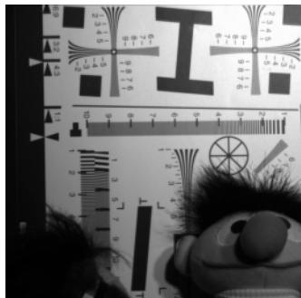  
Hyperspectral Image Toy

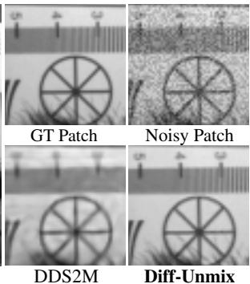  
Figure 1. Comparison (wavelength 600nm) between diffusion based DDS2M [36] and the proposed Diff-Unmix on a hyperspectral image Toy corrupted with Gaussian noise N (0, 0.3). Diff-Unmix shows the ability to restore fine details by leveraging a pretrained diffusion model on RGB images.

Similar to RGB images, HSIs exhibit spatial selfsimilarity, implying that similar pixels can be jointly denoised. Furthermore, HSIs possess inherent spectral correlations due to their nominal spectral resolution. Consequently, effective denoising methods for HSIs must consider the prior within both spatial and spectral domains. Traditional model-based HSI denoising approaches [11, 17, 22] rely on handcrafted priors to capture spatial and spectral correlations through iterative optimization. These methods often employ priors like total variation [20, 22, 68], non-local similarity [18], low-rank [9, 10] properties, and sparsity [53]. Nonetheless, the effectiveness of these methods relies heavily on the precision of manually crafted priors. Furthermore, model-based denoising entails significant computational demands due to iterative processes and may struggle to generalize across a wide range of scenarios.

To achieve robust noise removal, deep learning approaches [7, 44, 52, 60] have been applied to HSI denoising, achieving impressive results. However, many of these methods employ convolutional neural networks (CNNs) for feature extraction, relying on local filter responses within a limited receptive field to distinguish noise from signal. Recently, vision Transformers have shown promise in various tasks, including both high-level [16, 50] and lowlevel [2, 15, 61] tasks. They excel at modeling long-range dependencies in image regions. However, efficiently balancing the strength of noise reduction and details keeping remains a challenge for HSI denoising Transformers.

The spectral correlation also indicates that HSIs exhibit spectral low-rank sub-spaces [8, 10, 19, 31, 72], enabling them to retain valuable prior while suppressing noise. Thus, exploiting low-rank spectral statistics is essential for HSI denoising. However, existing methods [26, 57] mainly leverage low-rank characteristics through matrix factorization, relying on a single HSI and requiring substantial computation. Moreover, these methods are sensitive to noise reduction and high-frequency detail recovery due to hyperparameter tuning, e.g., rank and trade-off coefficients.

Based on the theory of spectral low-rank subspaces, it is natural to represent HSIs by decomposing mixed pixel spectra into their constituent endmembers and corresponding abundances, resulting in the product of two tensors [42]. One of these tensors possesses the same spatial dimensions as the HSI but significantly reduced spectral dimensions, referred to as abundance map. The other tensor represents the spectral endmembers, describing how the HSI is spanned by the abundance map. However, it is evident that this decomposition factorization is not unique [42], and the features of the base tensor generated by common decomposition strategies like Principal Component Analysis (PCA) and sparse representation do not resemble those of real images. Consequently, it becomes inconvenient to explicitly leverage well-established knowledge of image distribution.

To reconstruct details with high-quality while reduce noise effectively, we introduce a physically explainable diffusion model for HSI restoration, known as Diff-Unmix. Our approach aims to integrate the advantages of physical spectral unmixing models and generative networks. Diff-Unmix formulates HSI restoration as a spectral unmixing problem and conditional image generation task. In the spectral unmixing, we incorporate Transformer-based characteristics [33, 61] and meticulously design a Spectral Unmixing Transformer network (STU) to enhance the decomposition applicability. STU decomposes the HSI into endmembers and corresponding abundances. Subsequently, we employ a self-supervised conditioning function guided generative diffusion network to denoise the abundance while preserving high-frequency details and achieving improved restoration results. The main contributions are three folds:

\- We rethink HSI restoration from the perspective of conditional abundance generation. Rather than being limited to enhancing the original low-quality HSI, we propose a generative Unmixing framework to further compensate for content loss and spectral deviation caused by noise.

\- Considering the issues of decomposition in spectral unmixing models, we propose a novel Transformer decomposition network. It can take full advantage of multi-scale attention to efficiently unmix HSI.

\- We proposed a state matching and conditioning strategy, which enables the representation of noisy abundances as samples from an intermediate state in the diffusion Markov chain. This facilitates the generation of detailed, clean abundance maps without the need for ground truth.

## 2. Related Work

HSI denoising is an essential pre-processing step with applications in computer vision [10, 18, 56] and remote sensing [43, 60]. The field has seen the development of two main categories of denoising methods: model-based and deep learning-based approaches. Traditional model-based methods [11, 34, 34, 59, 69] typically approach noise removal through iterative optimization, guided by handcrafted priors. These methods include adaptive spatial-spectral dictionary methods [17] and the hyper-Laplacian regularized unidirectional low-rank tensor recovery method introduced by Chang et al. [10]. Additionally, some approaches integrate spatial non-local similarity and global spectral lowrank properties [18] for denoising, while others use spatial regularizers [34, 68] and low-rank regularization techniques [9] to model the spatial and spectral prior.

Deep learning methods [7, 37, 52, 57] have demonstrated great potential for automatically learning and representing features for HSI denoising. These approaches have explored spectral-spatial features using residual convolutional networks [60], spatial-spectral global reasoning networks [7], and hybrid convolutional and recurrent neural networks [37, 52]. Model-guided interpretable networks have also been actively investigated [5, 56]. Our proposed method stands out by exploring spectral unmixing transformer and multi-path generative diffusion networks to effectively recover high-quality spatial and spectral information.

Recently, there has been a growing trend in applying Transformers to HSI restoration [2, 47, 67] and HSI classification [25, 32]. While these techniques exhibit robust fitting capabilities for underlying data, the inherent variability between test and training data poses a challenge in effectively reducing noise while preserving fine-grained details. In this context, we propose a transformer based diffusion model with self-supervised conditioning function for HSI. This model adeptly captures the spectral-spatial properties, two pivotal characteristics of HSIs, and additionally generates high-quality textures through the diffusion process.

## 3. Methodology

Main Idea. Given a noisy HSI Y, the inverse problem for HSI denoising is to separate the clean image X , Gaussian noise N defined by:

$$
\mathcal {Y} = \mathcal {X} + \mathcal {N}.\tag{1}
$$

Given the inherently ill-posed nature of HSI reconstruction as an inverse problem, extant methodologies continue to grapple with several notable challenges in the simultaneous achievement of accurate detail reconstruction and effective noise reduction. The denoising diffusion model, endowed with its generative capability, stands out as a promising solution to this predicament. Nevertheless, (i) the dearth of HSI datasets relative to RGB images, along with the substantially higher dimensionality inherent in HSI data, presents a formidable hurdle when endeavoring to retrain a diffusion model tailored specifically for HSI applications. (ii) Using pre-trained 2-D diffusion models for individual HSI bands along the spectral axis is a potential strategy. However, this approach may lead to incoherent reconstructions due to the lack of consideration for inter-band dependencies and spectral correlations [21, 35, 51]. (iii) Furthermore, the iterative diffusion process for HSIs with tens or hundreds of bands can be time-intensive.

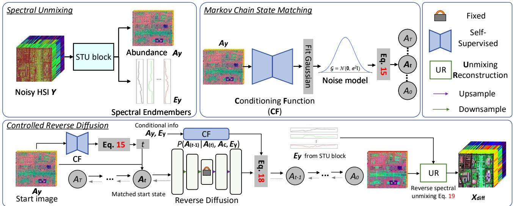  
Figure 2. The overall framework of Diff-Unmix consists of three distinct yet interrelated modules. These modules include the spectral unmixing based on Spectral Transformer Unmixing Network (STU, Fig. 3), serving as a latent space decomposition method with physical significance in the context of Hyperspectral Imaging. Additionally, we have the Conditioning Function (CF) and Abundance Diffusion Adjustment (ADA) modules, which play pivotal roles in refining the spectral unmixing process.

To answer these questions, in this section, we demonstrate that refined approximations of clean HSI $\hat { \mathcal { X } } ,$ can be produced through the integration of a spectral unmixing model, where ${ \mathcal { X } } = { \mathcal { A } } \times _ { 3 } E ,$ and a diffusion model operating on the abundance map, $\mathcal { A } . \mathrm { ~ } \times \mathrm { { 3 } }$ is mode-3 tensor matrix product [29]. To condition the diffusion sampling process on the noisy input, denoted as Y, our approach involves representing $\mathcal { A } _ { y } ( \mathcal { V } = \mathcal { A } _ { y } \times _ { 3 } E )$ as a sample drawn from a posterior distribution at an empirically derived intermediate state, denoted as $A _ { t } ,$ , within the Markov chain. Subsequently, we initiate the sampling procedure directly from $\mathcal { A } _ { y }$ via the conditional distribution $p ( A _ { T } | \mathcal { A } _ { y } )$

## 3.1. Transformer Unmixing Network

The spectral unmixing theory assumes that an image can be decomposed into abundance and spectral endmembers as:

$$
\mathcal {X} = \mathcal {A} \times_ {3} E,\tag{2}
$$

where X is the input HSI. A and E denote the abundance maps and spectral endmembers, respectively. It is essentially an ill-posed problem and many potential solutions exist. The abundance refers to the relative proportion of different pure materials, known as endmembers, present within a mixed pixel. These abundances signify the contribution of each endmember to the overall spectral signature observed in that pixel. For instance, in a landscape image, the abundance values would represent the percentages of materials like grass, soil, water, and rocks within a given pixel. On the other hand, endmembers represent the pure spectral signatures of individual materials in a scene, ideally devoid of any mixture [28]. They serve as reference spectra for known materials, so it tends to be constant in different noise degradation conditions. Thus, the noise is decomposed into the abundance map, and a visual illustration is shown in Fig. 3. The optimization objective to realize spectral unmixing in our method is generally represented via Eq. (3):

$$
\min _ {\mathcal {A}, E} \tau (\mathcal {A} \times_ {3} E) + \alpha \phi (\mathcal {A}) + \beta \psi (E),\tag{3}
$$

where $\tau ( A \times _ { 3 } E )$ ensures that the image can be reconstructed from the decomposed abundance and spectral endmembers. $\phi ( A ) , \psi ( E )$ constrain the consistency of abundance map and spectral endmembers. $\alpha , \beta$ are the hyperparameters. Subsequently, a self-supervised loss function is designed in next subsection.

## 3.1.1 Loss Functions

Utilizing the formulation presented in Equation (3), we formulate distinct loss functions: the reconstruction loss, abundance consistency loss, and spectral endmembers loss, which are integral components in the optimization process of the Transformer Unmixing Network. To address the need for abundance consistency under varying noise conditions, our training dataset comprises paired sets of noisy HSIs, denoted as $\mathcal { I } _ { n }$ , and their corresponding noise-variant counterparts, denoted as $\mathcal { T } _ { m }$ . The abundance maps derived from these datasets are denoted as $A _ { n }$ and $A _ { m }$ respectively. Additionally, the respective spectral endmembers are denoted as $E _ { n }$ and $E _ { m }$

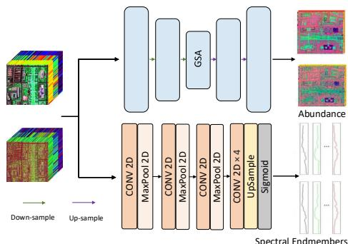  
Figure 3. Detailed architecture of STU Unmixing network, which consists of two parallel branches, and the details of Global Spectral Attention (GSA) is shown in Fig. 4.

Reconstruction Loss $\tau ( A \times _ { 3 } E )$ : This loss term ensures that the decomposed abundance maps \protec mahl {A} and spectral endmembers E accurately reconstruct the original hyperspectral image. It is defined by considering the fidelity of the reconstructed images:

$$
L _ {r e c} = \| \mathcal {I} _ {n} - \mathcal {A} _ {n} \times_ {3} E _ {n} \| _ {1} + \alpha_ {r e c} \| \mathcal {I} _ {m} - \mathcal {A} _ {m} \times_ {3} E _ {m} \| _ {1},\tag{4}
$$

where $\alpha _ { r e c }$ serves as a hyper-parameter, allowing for the adjustment of the contribution of different noise levels.

Abundance Fidelity Loss $\phi ( A )$ : The abundance loss term is used to ensure abundance fidelity, which is defined as:

$$
L _ {a f} = \left\| \mathcal {A} _ {n} - \mathcal {A} _ {m} \right\| _ {1}.\tag{5}
$$

Spectral Endmembers Consistency Loss $\psi ( L )$ : This loss term enforces the consistency of spectral endmembers under varying noise conditions, considering that the abundance of objects remains invariant,

$$
L _ {s e} = \left\| E _ {n} - E _ {m} \right\| _ {1}.\tag{6}
$$

Finally, the comprehensive decomposition loss is given by:

$$
L = L _ {r e c} + \gamma_ {a f} L _ {a f} + \gamma_ {s e} L _ {s e},\tag{7}
$$

where $\gamma _ { a f }$ and $\gamma _ { s e }$ represent hyper-parameters.

## 3.1.2 Network Architecture

As shown in Fig. 3, Spectral Transformer Unmixing network (STU) consists of two branches, i.e., the Abundance Decomposition (AD) branch and the Spectral Endmember Decomposition (SED) branch.

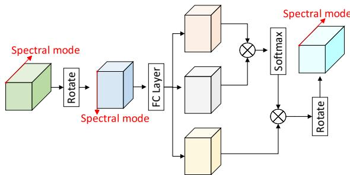  
Figure 4. Detailed network architecture of GSA. The attention is calculated in the direction of cross spectral mode to realize the efficient unmixing of a hyperspectral image.

In the spectral endmember decomposition branch, multiple convolutional layers are employed to reduce computational complexity while ensuring effective decomposition, as discussed in [58]. In the abundance decomposition branch of the $\mathbf { A D } ,$ a multi-stage spectral Transformer encoder and decoder are utilized to preserve the intrinsic characteristics of abundance and spectral endmember maps. This approach enhances recovery performance and information retention in the abundance map. Specifically, both the Transformer encoder and decoder incorporate a Global Spectral Attention module and a mapping layer. Given an image I of size $H \times W \times B$ to be decomposed, AD first obtains its embedding features $\mathcal { F } _ { \mathrm { i n i t } } \in \mathbb { R } ^ { H \times \mathbf { \dot { W } } \times C }$ through a convolutional projection, and the subsequent computations in the AD block can be summarized as:

$$
\hat {\mathcal {F}} _ {i} = \mathrm{GSA} (N o r m (\mathcal {F} _ {i - 1})) + \mathcal {F} _ {i - 1},\tag{8}
$$

$$
\mathcal {F} _ {i} = \mathrm{Mapping} (\hat {\mathcal {F}} _ {i}) + \hat {\mathcal {F}} _ {i},\tag{9}
$$

where Norm denotes normalization. $\mathcal { F } _ { i - 1 }$ represents the input feature map of the current AD block.

The time complexity of transformer scales quadratically with the image size, posing computational challenges for high-dimensional HSI data. Spectral unmixing primarily relies on spectral correlations among spectral bands. Consequently, allocating equal computational resources to both spatial and spectral modes during spectral unmixing decomposition may not be optimal. To solve this problem, inspired by the spectral attention in [30], we utilize a novel global spectral-wise attention (GSA) mechanism for computing attention in AD, as shown in Fig. 4. On the premise of maintaining the spectral unmixing performance, it reduces the attention computation complexity to a great extent.

In the GSA module, a feature tensor $\mathcal { X } \in \mathbb { R } ^ { H \times W \times C }$ obtained after applying Layer-Norm, is initially rotated as $\mathcal { X } ^ { \prime }$ for ease of correlating its spectral direction using a convolution operation. This leads to projections of the feature into ${ \mathcal { Q } } , \kappa ,$ and V. Specifically, the projections result in $\mathcal { Q } = W ^ { q } \mathcal { X ^ { \prime } } , \mathcal { K } = W ^ { k } \mathcal { X ^ { \prime } }$ , and $\mathcal { V } = W ^ { v } \mathcal { X } ^ { \prime }$ . This enables the computation of attention in the spectral mode direction

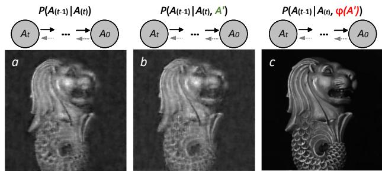  
Figure 5. Comparison on reverse diffusion start from noisy $\mathcal { A } ^ { \prime } .$ , (a) without condition, and conditioned on (b) $\mathcal { A } ^ { \prime } , ( \mathrm { c } ) \mathcal { A } _ { c } = \Phi ( \mathcal { A } ^ { \prime } )$ via a transformer module. Mathematically, it can be expressed as shown in Equation (10):

$$
\hat {\mathcal {X}} = \operatorname{softmax} (\mathcal {Q K} / d) \cdot \mathcal {V} + \mathcal {X},\tag{10}
$$

where d represents a scale factor.

## 3.2. Diffusion Generation Adjustment

This section introduces a methodology for generating precise abundance approximations (Aˆ) using a pre-trained offthe-shelf diffusion model enhanced with a trainable conditioning function. To condition the diffusion sampling on noisy input $( \mathcal { A } ^ { \prime } )$ , we represent it as a sample from a datadriven intermediate state $( \mathcal { A } _ { t } )$ in the Markov chain. We then initiate the sampling process directly from A′ through the conditional probability $p ( \boldsymbol { A } _ { t } | \boldsymbol { A } ^ { \prime } )$ , as shown in Fig. 2.

This formulation raises two key questions: (i) What methodology maps $\mathcal { A } ^ { \prime }$ to an intermediate state within the Markov chain? and (ii) How to control the pre-trained diffusion model to generate images with the intended semantics when the best-matched states is available? To streamline parameter tuning, we devise Diff-Unmix in two stages, each addressing these questions: (I) Markov chain state matching; and (II) Diffusion model reverse conditioning.

Forward Diffusion Process. The forward diffusion process can be viewed as a Markov chain progressively adding Gaussian noise to the data. The data at step t is only dependent on that at step t − 1. Given $t \in [ 0 , T ]$ , the transition probability is usually assumed to be a Gaussian distribution:

$$
q (\mathcal {A} _ {t} | \mathcal {A} _ {t - 1}) = \mathcal {N} (\mathcal {A} _ {t} | \sqrt {\alpha_ {t}} \mathcal {A} _ {t - 1}, (1 - \alpha_ {t}) \mathcal {I}),\tag{11}
$$

and its parameter $\alpha _ { t }$ is preset as constant. By using reparameterization, we can find the conditional distribution about $\boldsymbol { A } _ { t }$ and $S _ { 0 }$ as

$$
q (\mathcal {A} _ {t} | \mathcal {A} _ {0}) = \mathcal {N} (\mathcal {A} _ {t} | \sqrt {\bar {\alpha} _ {t}} \mathcal {A} _ {0}, (1 - \bar {\alpha} _ {t}) \mathcal {I}),\tag{12}
$$

where $\begin{array} { r } { \bar { \alpha } _ { t } \ = \prod _ { i = 1 } ^ { t } \alpha _ { t } } \end{array}$ . Then, in the forward process, the distribution $q ( \mathbf { \mathcal { A } } _ { t } | \mathbf { \mathcal { A } } _ { 0 } )$ approximates $\mathcal { N } ( 0 , 1 )$ with gradually adding noise to the previous state.

Conditioning Function Design. Denoising diffusion is known as its generation capability. However, due to the inherent stochastic nature of the generative process in DDPM, generating images with the intended semantics remains challenging even if we start with a state $\boldsymbol { \mathcal { A } } _ { T }$ on $\mathcal { A } ^ { \prime } .$

Using the observed noisy image $\mathcal { V }$ or A′ as direct conditions is a natural approach. However, the noisy image is of low quality and doesn’t offer effective guidance for both low-frequency structure and high-frequency texture, as demonstrated in Fig. 5. To exert more precise control over unconditional DDPM using observed noisy measurements, we employ Φ as a conditioning function to derive a conditional variable $\mathcal { A } _ { c } = \Phi ( \mathrm { S T U } ( \mathcal { V } ) ) ,$ in a self-supervised manner. Specifically, in signal processing, it is often assumed that noisy signals arise from the introduction of noise, based on a specified model, into clean signals [40, 55]. However, establishing an effective mapping between the input Y and the output X becomes challenging when we lack prior knowledge of this corruption process. Building upon the J-Invariance theory [4], we propose training a denoising neural network directly on noisy images. Using the noisy signal $\mathcal { V }$ as input, the denoising function Φ approximates a refined abundance matrix:

$$
\mathcal {A} _ {c} \approx \hat {\mathcal {A}} = \Phi (\mathcal {A} ^ {\prime}), \mathcal {A} ^ {\prime} = \mathrm{STU} (\mathcal {Y}).\tag{13}
$$

This method equips Φ to perform regression on lowdimensional abundances while incorporating spectral endmembers to form ${ \mathcal { V } } ^ { \prime } = { \hat { \mathcal { A } } } \times _ { 3 } E$ , which is important for unsupervised learning. This approach makes that: (i) training only weight-light Φ on A for the entire spectral sequence in a unsupervised manner, (ii) maintaining stable denoising quality even with heavy noise, and (iii) achieving improved spatial-spectral consistency in denoised bands. Here, we learn Φ via an U-Net-like “hourglass” architecture, and its detailed structure can be found in supplementary materials.

Here, we propose an unsupervised loss that ensures consistency, that is

$$
\begin{array}{l} \underset {\Phi} {\arg \min} \mathbb {E} _ {\mathcal {Y}} \left\{\| \mathcal {Y} - \Phi (\mathcal {A} ^ {\prime}) \times_ {3} E - \mathcal {N} \| ^ {2} \right\} \\ \qquad + \mathbb {E} _ {s} \left\{\| \hat {\mathcal {X}} - \Phi (\mathrm{STU} (\hat {\mathcal {X}}), A _ {s}) \times_ {3} E \| ^ {2} \right\}, \end{array}\tag{14}
$$

where $\hat { \mathcal { X } } = \Phi ( \mathcal { A } ^ { \prime } ) \times _ { 3 } E , A _ { s }$ is a transform randomly selected from a given set of transforms T , N is Gaussian noise with known deviation. The first term ensures measurement consistency $\mathcal { V } = \Phi ( \mathcal { A } ^ { \prime } ) \times _ { 3 } E + \mathcal { N }$ , whereas the second term enforces consistency across transforms, i.e., $\Phi ( { \cal A } ^ { \prime } ) = \Phi ( \mathrm { S T U } ( A _ { s } \Phi ( { \cal A } ^ { \prime } ) \times _ { 3 } E ) , A _ { s } )$ for all $A _ { s } \in T$

Markov Chain State Matching. Once an optimal mapping function is learned by Φ, noise model can also be obtained by fitting the approximated residual noise $\hat { \mathcal { N } }$ to a Gaussian distribution $\mathcal { N } ( \sigma ^ { 2 } \mathbf { I } )$ with zero mean and a variable standard deviation σ (G-Fit) [55]. Without any constraints, $\hat { \mathcal { N } }$ may not necessarily have a mean value of zero, and direct fitting can lead to a shift in the distribution mean. To address this, we propose to explicitly adjust the mean value of $\hat { \mathcal { N } }$ , denoted as $\begin{array} { r } { \mu _ { \hat { \mathcal { N } } } = \frac { \bar { 1 } } { | | \hat { \mathcal { N } } | | } \hat { \Sigma } \hat { \mathcal { N } } } \end{array}$ , to be zero: $\hat { \mathcal { N } } : = \hat { \mathcal { N } } - \pmb { \mu } _ { \hat { \mathcal { N } } }$

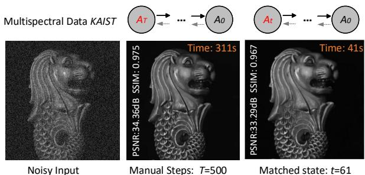  
Figure 6. Comparison on reverse diffusion conditioned on Φ(A ), started from manual steps T = 500 and the matched state $t = 6 1$

The adjusted $\hat { \mathcal { N } }$ can then be used to model the noise distribution $\mathcal { G }$ and estimate the parameter $\sigma .$ Recall that in the diffusion model, a noise schedule $\beta _ { 1 , \cdots , T }$ is predefined to represent the noise level at every state in the Markov chain. We identify a matching state of $\mathcal { A } ^ { \prime }$ by comparing the noise model with all possible posteriors $p ( \mathcal { A } _ { t } )$ in terms of σ and $\sqrt { \beta _ { t } }$ . Specifically, a state is considered a match when a time stamp t is found that minimizes the distance:

$$
\arg \min _ {t} | | \sqrt {\beta_ {t}} - \sigma | | ^ {p}, \sigma = \mathrm{G-Fit} (\hat {\mathcal {N}}, \mathcal {N} (\sigma^ {2} \mathbf {I})),\tag{15}
$$

where $| | \cdot | | ^ { p }$ denotes the p-norm distance. Since t is a discrete integer within a finite interval: $\{ 1 , \cdots , T \}$ , we reformulate the optimization problem as a surrogate search [55]. Controlled Reverse Diffusion Process. A match at state $\boldsymbol { A } _ { t }$ indicates that, given the specific noise schedule $\beta ,$ there exists at least one potential sample from the posterior at state $\boldsymbol { A } _ { t }$ in the baseline unconditional generation process that closely approximates the provided input $\mathcal { A } ^ { \prime } .$ . Consequently, a more precise image can be sampled at state $A _ { 0 }$ through an iterative reverse process denoted as $p ( \mathcal { A } _ { 0 } | \mathcal { A } _ { t } )$ with condition $\boldsymbol { A } _ { c }$ from (13). With the matched state t and trained $\epsilon _ { \theta } ( \cdot , t )$ , reverse diffusion process [24] starting from $\boldsymbol { A } _ { t }$ with noisy abundance $\boldsymbol { A } _ { t } = \boldsymbol { A } ^ { \prime }$ , and the reverse process is updated as follows:

$$
\mathcal {A} _ {t - 1} = \frac {1}{\sqrt {\alpha_ {t}}} \left(\mathcal {A} _ {t} - \frac {1 - \alpha_ {t}}{\sqrt {1 - \bar {\alpha} _ {t}}} \epsilon_ {\theta} (\mathcal {A} _ {t}, t)\right) + \sqrt {1 - \alpha_ {t}} z _ {t},\tag{16}
$$

where $z _ { t } \sim \mathcal { N } ( 0 , 1 ) , t \in [ T ]$ . As [42, 46], we formulate the ancestral sampling process (16) as the discretization of reverse SDE. Together with condition $\boldsymbol { A } _ { c }$ and the estimated endmembers $E$ as conditioning variables, we can reformulate the reverse SDE concerning \protec mahl {A} as

$$
d \mathcal {A} = \left[ f (\mathcal {A}, t) - g ^ {2} (t) \nabla_ {\mathcal {A} (t)} \log p _ {t} (\mathcal {A} (t) | \mathcal {A} _ {c}, E) \right] d t + g (t) d \bar {\mathbf {w}},\tag{17}
$$

where $f ( A , t ) = - \frac { 1 } { 2 } ( 1 - \alpha ( t ) )$ ) and $g ( t ) = \sqrt { 1 - \alpha ( t ) }$ w¯ is the reverse of the standard Wiener process. The gradient $\nabla _ { \boldsymbol { A } ( t ) }$ log $p _ { t } ( \mathcal { A } ( t ) )$ is commonly referred to as the score function of $\boldsymbol { \mathcal { A } } ( t )$ . Then, we discretize the reverse SDE (17)

using the form of ancestral sampling process (16):

$$
\begin{array}{l} \mathcal {A} _ {t - 1} = \frac {1}{\sqrt {\alpha_ {t}}} \left(\mathcal {A} _ {t} + (1 - \alpha_ {t}) \nabla_ {\mathcal {A} (t)} \log p _ {t} (\mathcal {A} (t) | \mathcal {A} _ {c}, E)\right) \\ \approx \frac {1}{\sqrt {\alpha_ {t}}} \left(\mathcal {A} _ {t} - \frac {1 - \alpha_ {t}}{\sqrt {1 - \bar {\alpha} _ {t}}} \epsilon_ {\theta} (\mathcal {A} _ {t}, t)\right) + \sqrt {1 - \alpha_ {t}} z _ {t} \\ - \eta \nabla_ {\mathcal {A} _ {t}} \| \mathcal {A} _ {c} - \hat {\mathcal {A}} _ {0} \times_ {3} E \| _ {F}, \end{array} \tag {18}
$$

where $\eta = \frac { 1 - \alpha _ { t } } { \sqrt { \alpha _ { t } } } \gamma .$ . At time $t ,$ we can see that the sampling consists of two parts. The first part is equal to sampling from parameterized $p ( \mathcal { A } _ { t - 1 } | \mathcal { A } _ { t } )$ with fixed variance $\sqrt { 1 - \alpha _ { t } }$ . The second part pushes the sample towards the consistent form with constraint on abundance. See supplementary materials for the detailed inference of (17) and (18). Finally, the HSI is reconstructed through unmixing reconstruction, achieved by mixing the diffusion generative adjusted abundance map with the spectral endmembers,

$$
\mathcal {X} _ {\mathrm{diff}} = \hat {\mathcal {A}} _ {0} \times_ {3} E _ {y}.\tag{19}
$$

## 4. Experiment

## 4.1. Implementation Details and Datasets

Implementation Details. The proposed Diff-Unmix model undergoes two self-supervised training stages. Initially, the STU is trained, then we fix the pre-trained diffusion model [1] with unconditional mode and train the conditioning function associated with the diffusion generation adjustment. The transform set T includes shift, flip, rotation. The input image are cropped to patches of size $2 5 6 \times 2 5 6$ . All experiments are conducted using PyTorch on two NVIDIA RTX 4060Ti GPUs running Ubuntu 22.04.2.

Datasets. To assess generalization capabilities, we train the conditioning function and STU block on CAVE dataset in a self-supervised manner, then test Diff-Unmix on KAIST [14], CAVE, CAVE-Toy [38] datasets with simulated Gaussian noise: $\mathcal { N } ( 0 , 0 . 2 )$ , and $\mathcal { N } ( 0 , 0 . 3 )$ , and Urban 1 dataset with real-world noise including stripes, deadlines, atmospheric interference, water absorption, and other unidentified sources.

## 4.2. Synthetic Noise

In simulated noise case, we compare the proposed Diff-Unmix with 15 SOTA denoising methods within five categories: (1) optimization based NonLRMA [12], LRTDTV [63], LLRSSTV [21], TLRLSSTV [65], LLxRGTV [64], 3DTNN [70], 3DTNN FW [71], LRTD-CTV [63], E3DTV [39], FGSLR [13], (2) deep prior based DIP [45], (3) plug and play framework based LLRPnP [66], (4) self-supervised tensor network HLRTF [35], (5) diffusion based DDRM [27] and DDS2M [36]. The STU unmixing block and conditioning function are trained on CAVE dataset in a self-supervised manner. For the optimization based methods, the hyperparameters are set according to the original papers, and we fine-tune the rank slightly to get better PSNR. For DDRM, we adapt its denoising models with $\sigma = 0 . 2 , 0 . 3 .$ . In Tab. 1 and Tab. 2, Fig. 8, 7, 9, we present the denoising performance of the different methods. One can see that Diff-Unmix achieves the best indexes and visual effects in most cases.

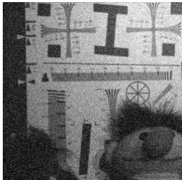

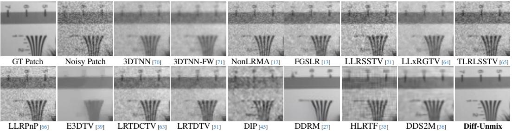

Figure 7. Visual comparison of HSI denoising methods on Toy dataset.  
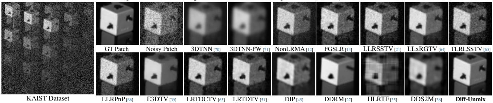

Figure 8. Visual comparison of HSI denoising methods on KAIST dataset.  
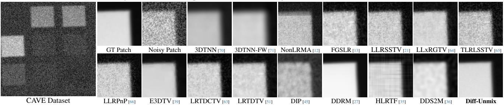  
Figure 9. Visual comparison of HSI denoising methods on CAVE dataset.

Table 1. Quantitative PSNR, SSIM, FSIM, SAM and Time on KAIST dataset, gray: deep prior, PnP and tensor network based models, yellow: denoising diffusion based methods, the rest is model based algorithm. Left: Case: N (0, 0.2), right: Case: N (0, 0.3).

<table><tr><td>Method</td><td>Reference</td><td>PSNR ↑</td><td>SSIM ↑</td><td>FSIM ↑</td><td>SAM ↓</td><td>Time (s)</td></tr><tr><td>Noisy</td><td>None</td><td>16.175</td><td>0.115</td><td>0.401</td><td>0.801</td><td>None</td></tr><tr><td>NonLRMA [12]</td><td>TGRS 2017</td><td>21.259</td><td>0.414</td><td>0.803</td><td>0.882</td><td>11</td></tr><tr><td>LRTDTV [51]</td><td>JSTAR 2017</td><td>31.061</td><td>0.772</td><td>0.882</td><td>0.297</td><td>38</td></tr><tr><td>LLRSSTV [21]</td><td>JSTAR 2018</td><td>28.145</td><td>0.682</td><td>0.814</td><td>0.432</td><td>36</td></tr><tr><td>TLR_LSSTV [65]</td><td>TGRS 2021</td><td>24.875</td><td>0.532</td><td>0.767</td><td>0.395</td><td>76</td></tr><tr><td>LLxRGTV [64]</td><td>SP 2021</td><td>31.152</td><td>0.802</td><td>0.917</td><td>0.205</td><td>38</td></tr><tr><td>3DTNN [70]</td><td>IS 2020</td><td>25.477</td><td>0.668</td><td>0.887</td><td>0.227</td><td>16</td></tr><tr><td>3DTNN_FW [71]</td><td>TGRS 2019</td><td>28.035</td><td>0.780</td><td>0.881</td><td>0.197</td><td>20</td></tr><tr><td>LRTDCTV [63]</td><td>JSTAR 2023</td><td>25.952</td><td>0.658</td><td>0.816</td><td>0.406</td><td>43</td></tr><tr><td>E3DTV [39]</td><td>TIP 2020</td><td>30.335</td><td>0.868</td><td>0.926</td><td>0.221</td><td>10</td></tr><tr><td>FGSLR [13]</td><td>TGRS 2021</td><td>30.126</td><td>0.737</td><td>0.878</td><td>0.262</td><td>249</td></tr><tr><td>DIP [45]</td><td>ICCVW 2019</td><td>24.181</td><td>0.608</td><td>0.825</td><td>0.475</td><td>72</td></tr><tr><td>LLRPnP [66]</td><td>IA 2020</td><td>28.664</td><td>0.748</td><td>0.861</td><td>0.379</td><td>240</td></tr><tr><td>HLRTF [35]</td><td>CVPR 2022</td><td>33.011</td><td>0.808</td><td>0.925</td><td>0.275</td><td>23</td></tr><tr><td>DDRM [27]</td><td>NeurIPS 2022</td><td>29.412</td><td>0.865</td><td>0.922</td><td>0.293</td><td>20</td></tr><tr><td>DDS2M [36]</td><td>ICCV 2023</td><td>32.804</td><td>0.786</td><td>0.895</td><td>0.334</td><td>354</td></tr><tr><td>Diff-Unmix</td><td>Ours</td><td>33.059</td><td>0.964</td><td>0.940</td><td>0.116</td><td>37</td></tr></table>

<table><tr><td>Method</td><td>Reference</td><td>PSNR ↑</td><td>SSIM ↑</td><td>FSIM ↑</td><td>SAM ↓</td><td>Time (s)</td></tr><tr><td>Nosiy</td><td>None</td><td>12.980</td><td>0.064</td><td>0.320</td><td>0.862</td><td>None</td></tr><tr><td>NonLRMA [12]</td><td>TGRS 2017</td><td>20.300</td><td>0.355</td><td>0.772</td><td>0.918</td><td>11</td></tr><tr><td>LRTDTV [51]</td><td>JSTAR 2017</td><td>28.606</td><td>0.670</td><td>0.829</td><td>0.331</td><td>38</td></tr><tr><td>LLRSSTV [21]</td><td>JSTAR 2018</td><td>25.340</td><td>0.562</td><td>0.743</td><td>0.487</td><td>37</td></tr><tr><td>TLR_LSSTV [65]</td><td>TGRS 2021</td><td>22.824</td><td>0.407</td><td>0.689</td><td>0.459</td><td>76</td></tr><tr><td>LLxRGTV [64]</td><td>SP 2021</td><td>27.640</td><td>0.679</td><td>0.868</td><td>0.218</td><td>38</td></tr><tr><td>3DTNN [70]</td><td>IS 2020</td><td>22.278</td><td>0.558</td><td>0.853</td><td>0.271</td><td>16</td></tr><tr><td>3DTNN_FW [71]</td><td>TGRS 2019</td><td>26.035</td><td>0.724</td><td>0.848</td><td>0.212</td><td>20</td></tr><tr><td>LRTDCTV [63]</td><td>JSTAR 2023</td><td>24.593</td><td>0.533</td><td>0.739</td><td>0.431</td><td>42</td></tr><tr><td>E3DTV [39]</td><td>TIP 2020</td><td>28.358</td><td>0.819</td><td>0.900</td><td>0.248</td><td>9</td></tr><tr><td>FGSLR [13]</td><td>TGRS 2021</td><td>25.561</td><td>0.480</td><td>0.718</td><td>0.470</td><td>499</td></tr><tr><td>DIP [45]</td><td>ICCVW 2019</td><td>20.063</td><td>0.405</td><td>0.798</td><td>0.538</td><td>74</td></tr><tr><td>LLRPnP[66]</td><td>IA 2020</td><td>25.102</td><td>0.592</td><td>0.768</td><td>0.425</td><td>289</td></tr><tr><td>HLRTF [35]</td><td>CVPR 2022</td><td>30.340</td><td>0.689</td><td>0.874</td><td>0.329</td><td>25</td></tr><tr><td>DDRM [27]</td><td>NeurIPS 2022</td><td>27.810</td><td>0.786</td><td>0.893</td><td>0.387</td><td>23</td></tr><tr><td>DDS2M [36]</td><td>ICCV 2023</td><td>30.078</td><td>0.666</td><td>0.834</td><td>0.355</td><td>318</td></tr><tr><td>Diff-Unmix</td><td>Ours</td><td>31.408</td><td>0.902</td><td>0.958</td><td>0.282</td><td>42</td></tr></table>

## 4.3. Real-World Noise

The urban HSI is affected by a range of noise sources including stripes, deadlines, atmospheric interference, water absorption, and other unidentified sources [23]. In Fig. 10, a comparison on the real Urban dataset is shown. It is evident that HLRTF and Diff-Unmix demonstrate superior denoising capabilities when compared to DDRM and DDS2M. Although DDRM and DDS2M perform well under simulated Gaussian noise, they tend to overly smooth out crucial details when confronted with real mixed noise. On the other hand, Diff-Unmix efficiently retains most of the details while effectively removing mixed noise by utilizing information from diverse spectral bands.

Table 2. Quantitative results on CAVE and CAVE-Toy dataset, gray: deep prior, PnP and tensor network based models, yellow: denoising diffusion based methods, the rest is optimization based algorithm. PSNR, SSIM, FSIM, SAM and running time are reported. (a) Comparisons on Toy dataset. (b) Comparisons on CAVE dataset.

<table><tr><td>Method</td><td colspan="2">Framework</td><td>PSNR ↑</td><td>SSIM ↑</td><td>FSIM ↑</td><td>SAM ↓</td><td>Time (s)</td></tr><tr><td>Noisy</td><td>None</td><td>None</td><td>12.334</td><td>0.122</td><td>0.374</td><td>0.605</td><td>None</td></tr><tr><td>NonLRMA [12]</td><td>Model</td><td>Self-Sup</td><td>21.600</td><td>0.566</td><td>0.766</td><td>0.268</td><td>12</td></tr><tr><td>LRTDTV [51]</td><td>Model</td><td>Self-Sup</td><td>26.578</td><td>0.729</td><td>0.836</td><td>0.181</td><td>39</td></tr><tr><td>TLR_LSSTV [65]</td><td>Model</td><td>Self-Sup</td><td>21.681</td><td>0.556</td><td>0.736</td><td>0.199</td><td>80</td></tr><tr><td>LLxRGTV [64]</td><td>Model</td><td>Self-Sup</td><td>26.450</td><td>0.752</td><td>0.874</td><td>0.118</td><td>39</td></tr><tr><td>3DTNN [70]</td><td>Model</td><td>Self-Sup</td><td>23.397</td><td>0.712</td><td>0.857</td><td>0.124</td><td>19</td></tr><tr><td>3DTNN_FW [71]</td><td>Model</td><td>Self-Sup</td><td>25.496</td><td>0.771</td><td>0.843</td><td>0.111</td><td>23</td></tr><tr><td>LRTDCTV [63]</td><td>Model</td><td>Self-Sup</td><td>25.214</td><td>0.665</td><td>0.783</td><td>0.228</td><td>45</td></tr><tr><td>E3DTV [39]</td><td>Model</td><td>Self-Sup</td><td>24.157</td><td>0.810</td><td>0.878</td><td>0.156</td><td>11</td></tr><tr><td>FGSLR [13]</td><td>Model</td><td>Self-Sup</td><td>21.525</td><td>0.573</td><td>0.798</td><td>0.241</td><td>1149</td></tr><tr><td>TwoStage [41]</td><td>CNN</td><td>Semi-Sup</td><td>29.032</td><td>0.869</td><td>0.911</td><td>0.181</td><td>2h+</td></tr><tr><td>DIP [45]</td><td>CNN</td><td>Self-Sup</td><td>22.092</td><td>0.594</td><td>0.895</td><td>0.191</td><td>67</td></tr><tr><td>LLRPnP [66]</td><td>PnP</td><td>Self-Sup</td><td>23.088</td><td>0.541</td><td>0.717</td><td>0.207</td><td>240</td></tr><tr><td>HLRTF [35]</td><td colspan="2">Tensor-CNN Self-Sup</td><td>27.308</td><td>0.730</td><td>0.941</td><td>0.161</td><td>41</td></tr><tr><td>DDRM [27]</td><td>Diffusion</td><td>Self-Sup</td><td>27.886</td><td>0.858</td><td>0.910</td><td>0.159</td><td>16</td></tr><tr><td>DDS2M [36]</td><td>Diffusion</td><td>Self-Sup</td><td>29.344</td><td>0.844</td><td>0.977</td><td>0.111</td><td>320</td></tr><tr><td>Diff-Unmix</td><td>Diffusion</td><td>Self-Sup</td><td>28.046</td><td>0.945</td><td>0.993</td><td>0.156</td><td>43</td></tr></table>

<table><tr><td>Method</td><td>Reference</td><td>PSNR ↑</td><td>SSIM ↑</td><td>FSIM ↑</td><td>SAM ↓</td><td>Time (s)</td></tr><tr><td>Nosiy</td><td>None</td><td>12.980</td><td>0.064</td><td>0.320</td><td>0.862</td><td>None</td></tr><tr><td>NonLRMA [12]</td><td>TGRS 2017</td><td>22.002</td><td>0.374</td><td>0.764</td><td>0.612</td><td>14</td></tr><tr><td>LRTDTV [51]</td><td>JSTAR 2017</td><td>30.545</td><td>0.678</td><td>0.766</td><td>0.241</td><td>42</td></tr><tr><td>LLRSSTV [21]</td><td>JSTAR 2018</td><td>25.319</td><td>0.435</td><td>0.641</td><td>0.299</td><td>39</td></tr><tr><td>TLR_LSSTV [65]</td><td>TGRS 2021</td><td>24.375</td><td>0.352</td><td>0.589</td><td>0.314</td><td>82</td></tr><tr><td>LLxRGTV [64]</td><td>SP 2021</td><td>28.743</td><td>0.712</td><td>0.829</td><td>0.121</td><td>40</td></tr><tr><td>3DTNN [70]</td><td>IS 2020</td><td>25.161</td><td>0.826</td><td>0.922</td><td>0.094</td><td>17</td></tr><tr><td>3DTNN_FW [71]</td><td>TGRS 2019</td><td>31.069</td><td>0.930</td><td>0.918</td><td>0.116</td><td>23</td></tr><tr><td>LRTDCTV [63]</td><td>JSTAR 2023</td><td>24.394</td><td>0.444</td><td>0.631</td><td>0.315</td><td>47</td></tr><tr><td>E3DTV[39]</td><td>TIP 2020</td><td>32.344</td><td>0.951</td><td>0.955</td><td>0.108</td><td>11</td></tr><tr><td>FGSLR [13]</td><td>TGRS 2021</td><td>24.474</td><td>0.346</td><td>0.554</td><td>0.511</td><td>1758</td></tr><tr><td>DIP [45]</td><td>ICCVW 2019</td><td>20.480</td><td>0.554</td><td>0.864</td><td>0.313</td><td>66</td></tr><tr><td>LLRPnP[66]</td><td>IA 2020</td><td>24.809</td><td>0.445</td><td>0.668</td><td>0.284</td><td>246</td></tr><tr><td>HLRTF [35]</td><td>CVPR 2022</td><td>30.308</td><td>0.770</td><td>0.861</td><td>0.185</td><td>133</td></tr><tr><td>DDRM [27]</td><td>NeurIPS 2022</td><td>30.521</td><td>0.754</td><td>0.873</td><td>0.196</td><td>16</td></tr><tr><td>DDS2M [36]</td><td>ICCV 2023</td><td>30.837</td><td>0.724</td><td>0.863</td><td>0.251</td><td>319</td></tr><tr><td>Diff-Unmix</td><td>Ours</td><td>32.714</td><td>0.940</td><td>0.957</td><td>0.129</td><td>43</td></tr></table>

Real Urban  
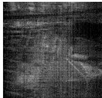

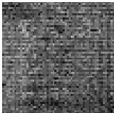  
Noisy Patch

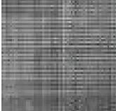  
DDRM [27]

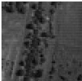  
SST [30]

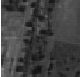  
HLRTF [35]  
SERT [31]

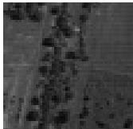

DDS2M [36]  
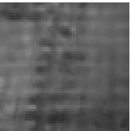

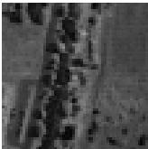  
Diff-Unmix

Figure 10. Results on Urban with real-world noise including stripes, deadlines, atmospheric interference, water absorption, and other unidentified sources. One can see that our Diff-Unmix adeptly mitigates mixed noise, ensuring the retention of fine-grained details.  
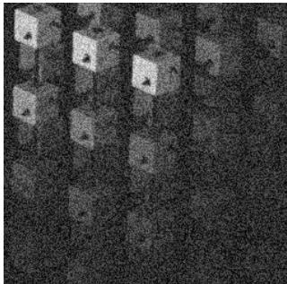  
KAIST

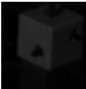

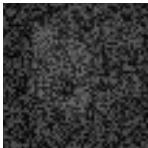

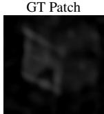  
DDS2M [36]

GT with N (0, 0.3)  
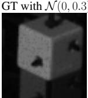  
Diff-Unmix  
Figure 11. Visual comparison on over-enhanced case.

## 4.4. Ablation Study

Transformer Unmixing Network. To assess the efficacy of the STU network, we conduct a visual analysis of the decomposition process. It is crucial to note that spectral unmixing poses an inherently ill-posed problem, lacking an exact optimal solution. A pivotal consideration is the necessity for consistent endmember information across varying levels of noise. For comparative purposes, we also employ Singular Value Decomposition technique for unmixing, the results are shown in supplementary material.

Markov Chain State Matching. The impact of State Matching is illustrated in Fig. 6, demonstrating that aligning the noisy input with an intermediate state in the diffusion

Markov chain accelerates the inference process, leading to a faster generation of the desired HSI (41s vs. 311s).

Conditioning Function Φ. A visual comparison of Diff-Unmix w/ and w/o conditioning on Φ is depicted in Fig. 5. It is evident that the inclusion of Φ effectively guides the Diff-Unmix process to generate high-quality details.

## 4.5. Limitations

Similar to many applications of DDPM, Diff-Unmix has the potential to generate spurious details (over-enhancement) due to its generative nature, as illustrated in Fig. 11. In contrast, DDS2M yields a distorted result in this scenario.

## 5. Conclusion

In this paper, we rethink the HSI denoising task and propose a generative Diff-Unmix denoising model. Diff-Unmix formulates the HSI denoising task as a paradigm of spectral unmixing and image generation. It can adaptively decompose images into abundance map and spectral endmembers and solve degradation by generative denoising diffusion models. The experimental results show that Diff-Unmix has excellent performance and makes subtle-detail completion and inference details restoration of noise reduction into reality. Besides, the proposed method demonstrates superior generalization capacity for unseen real and mixed noise compared to state-of-the-art methods.

## 6. Acknowledgments

This work was supported in part by the Flemish Government (AI Research Program), UGent-Special Research Fund (BOF).

## References

[1] Wele Gedara Chaminda Bandara, Nithin Gopalakrishnan Nair, and Vishal M Patel. Ddpm-cd: Remote sensing change detection using denoising diffusion probabilistic models. arXiv preprint arXiv:2206.11892, 2022. 6

[2] Wele Gedara Chaminda Bandara and Vishal M Patel. Hypertransformer: A textural and spectral feature fusion transformer for pansharpening. In CVPR, pages 1767–1777, 2022. 2

[3] Robert W Basedow, Dwayne C Carmer, and Mark E Anderson. Hydice system: Implementation and performance. In Imaging Spectrometry, volume 2480, pages 258–267. SPIE, 1995. 1

[4] Joshua Batson and Loic Royer. Noise2self: Blind denoising by self-supervision. In ICML, pages 524–533. PMLR, 2019. 5

[5] Theo Bodrito, Alexandre Zouaoui, Jocelyn Chanussot, and´ Julien Mairal. A trainable spectral-spatial sparse coding model for hyperspectral image restoration. In NeurIPS, volume 34, pages 5430–5442, 2021. 2

[6] Peter Burai, Bal´ azs De´ ak, Orsolya Valk´ o, and Tam´ as To-´ mor. Classification of herbaceous vegetation using airborne hyperspectral imagery. Remote Sensing, 7(2):2046–2066, 2015. 1

[7] Xiangyong Cao, Xueyang Fu, Chen Xu, and Deyu Meng. Deep spatial-spectral global reasoning network for hyperspectral image denoising. IEEE TGRS, 2021. 1, 2

[8] Xiangyong Cao, Qian Zhao, Deyu Meng, Yang Chen, and Zongben Xu. Robust low-rank matrix factorization under general mixture noise distributions. IEEE TIP, 25(10):4677– 4690, 2016. 2

[9] Yi Chang, Luxin Yan, Xi-Le Zhao, Houzhang Fang, Zhijun Zhang, and Sheng Zhong. Weighted low-rank tensor recovery for hyperspectral image restoration. IEEE TCYB, 50(11):4558–4572, 2020. 1, 2

[10] Yi Chang, Luxin Yan, and Sheng Zhong. Hyper-laplacian regularized unidirectional low-rank tensor recovery for multispectral image denoising. In CVPR, pages 4260–4268, 2017. 1, 2

[11] Guangyi Chen and Shen-En Qian. Denoising of hyperspectral imagery using principal component analysis and wavelet shrinkage. IEEE TGRS, 49(3):973–980, 2010. 1, 2

[12] Yongyong Chen, Yanwen Guo, Yongli Wang, Dong Wang, Chong Peng, and Guoping He. Denoising of hyperspectral images using nonconvex low rank matrix approximation. IEEE TGRS, 55(9):5366–5380, 2017. 6, 7, 8

[13] Yong Chen, Ting-Zhu Huang, Wei He, Xi-Le Zhao, Hongyan Zhang, and Jinshan Zeng. Hyperspectral image denoising using factor group sparsity-regularized nonconvex low-rank approximation. IEEE TGRS, 60:1–16, 2021. 6, 7, 8

[14] Inchang Choi, MH Kim, D Gutierrez, DS Jeon, and G Nam. High-quality hyperspectral reconstruction using a spectral prior. In Technical report, 2017. 6

[15] Xiangxiang Chu, Zhi Tian, Yuqing Wang, Bo Zhang, Haibing Ren, Xiaolin Wei, Huaxia Xia, and Chunhua Shen. Twins: Revisiting the design of spatial attention in vision transformers. In NeurIPS, volume 34, pages 9355–9366, 2021. 2

[16] Alexey Dosovitskiy, Lucas Beyer, Alexander Kolesnikov,

Dirk Weissenborn, Xiaohua Zhai, Thomas Unterthiner, Mostafa Dehghani, Matthias Minderer, Georg Heigold, Sylvain Gelly, et al. An image is worth 16x16 words: Transformers for image recognition at scale. arXiv preprint arXiv:2010.11929, 2020. 1

[17] Ying Fu, Antony Lam, Imari Sato, and Yoichi Sato. Adaptive spatial-spectral dictionary learning for hyperspectral image denoising. In ICCV, pages 343–351, 2015. 1, 2

[18] Wei He, Quanming Yao, Chao Li, Naoto Yokoya, and Qibin Zhao. Non-local meets global: An integrated paradigm for hyperspectral denoising. In CVPR, pages 6868–6877, 2019. 1, 2

[19] Wei He, Quanming Yao, Chao Li, Naoto Yokoya, Qibin Zhao, Hongyan Zhang, and Liangpei Zhang. Non-local meets global: An iterative paradigm for hyperspectral image restoration. IEEE TPAMI, 44(4):2089–2107, 2020. 2

[20] Wei He, Hongyan Zhang, Huanfeng Shen, and Liangpei Zhang. Hyperspectral image denoising using local low-rank matrix recovery and global spatial–spectral total variation. IEEE J-STARS, 11(3):713–729, 2018. 1

[21] Wei He, Hongyan Zhang, Huanfeng Shen, and Liangpei Zhang. Hyperspectral image denoising using local low-rank matrix recovery and global spatial–spectral total variation. IEEE J-STARS, 11(3):713–729, 2018. 3, 6, 7, 8

[22] Wei He, Hongyan Zhang, Liangpei Zhang, and Huanfeng Shen. Total-variation-regularized low-rank matrix factorization for hyperspectral image restoration. IEEE TGRS, 54(1):178–188, 2015. 1

[23] Wei He, Hongyan Zhang, Liangpei Zhang, and Huanfeng Shen. Total-variation-regularized low-rank matrix factorization for hyperspectral image restoration. IEEE TGRS, 54(1):178–188, 2015. 7

[24] Jonathan Ho, Ajay Jain, and Pieter Abbeel. Denoising diffusion probabilistic models. NeurIPS, 33:6840–6851, 2020. 6

[25] Danfeng Hong, Zhu Han, Jing Yao, Lianru Gao, Bing Zhang, Antonio Plaza, and Jocelyn Chanussot. Spectralformer: Rethinking hyperspectral image classification with transformers. IEEE TGRS, 60:1–15, 2021. 2

[26] Jie Huang, Ting-Zhu Huang, Liang-Jian Deng, and Xi-Le Zhao. Joint-sparse-blocks and low-rank representation for hyperspectral unmixing. IEEE TGRS, 57(4):2419–2438, 2018. 2

[27] Bahjat Kawar, Michael Elad, Stefano Ermon, and Jiaming Song. Denoising diffusion restoration models. NeurIPS, 35:23593–23606, 2022. 6, 7, 8

[28] Nirmal Keshava and John F Mustard. Spectral unmixing. IEEE signal processing magazine, 19(1):44–57, 2002. 3

[29] Tamara G Kolda and Brett W Bader. Tensor decompositions and applications. SIAM review, 51(3):455–500, 2009. 3

[30] Miaoyu Li, Ying Fu, and Yulun Zhang. Spatial-spectral transformer for hyperspectral image denoising. In Proceedings of the AAAI Conference on Artificial Intelligence, volume 37, pages 1368–1376, 2023. 4, 8

[31] Miaoyu Li, Ji Liu, Ying Fu, Yulun Zhang, and Dejing Dou. Spectral enhanced rectangle transformer for hyperspectral image denoising. In CVPR, pages 5805–5814, 2023. 2, 8

[32] Bing Liu, Anzhu Yu, Kuiliang Gao, Xiong Tan, Yifan Sun, and Xuchu Yu. Dss-trm: Deep spatial–spectral transformer

for hyperspectral image classification. European Journal of Remote Sensing, 55(1):103–114, 2022. 2

[33] Ze Liu, Yutong Lin, Yue Cao, Han Hu, Yixuan Wei, Zheng Zhang, Stephen Lin, and Baining Guo. Swin transformer: Hierarchical vision transformer using shifted windows. In ICCV, pages 10012–10022, 2021. 2

[34] Ting Lu, Shutao Li, Leyuan Fang, Yi Ma, and Jon Atli´ Benediktsson. Spectral–spatial adaptive sparse representation for hyperspectral image denoising. IEEE TGRS, 54(1):373–385, 2015. 2

[35] Yisi Luo, Xi-Le Zhao, Deyu Meng, and Tai-Xiang Jiang. Hlrtf: Hierarchical low-rank tensor factorization for inverse problems in multi-dimensional imaging. In CVPR, pages 19303–19312, 2022. 3, 6, 7, 8

[36] Yuchun Miao, Lefei Zhang, Liangpei Zhang, and Dacheng Tao. Dds2m: Self-supervised denoising diffusion spatiospectral model for hyperspectral image restoration. In ICCV, pages 12086–12096, 2023. 1, 6, 7, 8

[37] Erting Pan, Yong Ma, Xiaoguang Mei, Fan Fan, Jun Huang, and Jiayi Ma. Sqad: Spatial-spectral quasi-attention recurrent network for hyperspectral image denoising. IEEE TGRS. 2

[38] Jong-Il Park, Moon-Hyun Lee, Michael D Grossberg, and Shree K Nayar. Multispectral imaging using multiplexed illumination. In ICCV, pages 1–8. IEEE, 2007. 6

[39] Jiangjun Peng, Qi Xie, Qian Zhao, Yao Wang, Leung Yee, and Deyu Meng. Enhanced 3dtv regularization and its applications on hsi denoising and compressed sensing. IEEE TIP, 29:7889–7903, 2020. 6, 7, 8

[40] Mangal Prakash, Alexander Krull, and Florian Jug. Fully unsupervised diversity denoising with convolutional variational autoencoders. arXiv preprint arXiv:2006.06072, 2020. 5

[41] Yuntao Qian, Honglin Zhu, Ling Chen, and Jun Zhou. Hyperspectral image restoration with self-supervised learning: A two-stage training approach. IEEE TGRS, 60:1–17, 2021. 8

[42] Xiangyu Rui, Xiangyong Cao, Zeyu Zhu, Zongsheng Yue, and Deyu Meng. Unsupervised pansharpening via low-rank diffusion model. arXiv preprint arXiv:2305.10925, 2023. 2, 6

[43] Qian Shi, Xiaopei Tang, Taoru Yang, Rong Liu, and Liangpe Zhang. Hyperspectral image denoising using a 3-d attention denoising network. IEEE TGRS, 2021. 2

[44] Oleksii Sidorov and Jon Yngve Hardeberg. Deep hyperspectral prior: Single-image denoising, inpainting, superresolution. In CVPR, pages 0–0, 2019. 1

[45] Oleksii Sidorov and Jon Yngve Hardeberg. Deep hyperspectral prior: Single-image denoising, inpainting, superresolution. In ICCV, pages 0–0, 2019. 6, 7, 8

[46] Yang Song, Jascha Sohl-Dickstein, Diederik P Kingma, Abhishek Kumar, Stefano Ermon, and Ben Poole. Score-based generative modeling through stochastic differential equations. In ICLR, 2021. 6

[47] Xunyang Su, Jinjiang Li, and Zhen Hua. Transformer-based regression network for pansharpening remote sensing images. IEEE TGRS, 60:1–23, 2022. 2

[48] Muhammad Uzair, Arif Mahmood, and Ajmal Mian. Hyperspectral face recognition with spatiospectral information fusion and pls regression. IEEE TIP, 24(3):1127–1137, 2015.

[49] Muhammad Uzair, Arif Mahmood, and Ajmal S Mian. Hyperspectral face recognition using 3d-dct and partial least squares. In BMVC, volume 1, page 10, 2013. 1

[50] Wenhai Wang, Enze Xie, Xiang Li, Deng-Ping Fan, Kaitao Song, Ding Liang, Tong Lu, Ping Luo, and Ling Shao. Pyramid vision transformer: A versatile backbone for dense prediction without convolutions. In ICCV, pages 568–578, 2021. 1

[51] Yao Wang, Jiangjun Peng, Qian Zhao, Yee Leung, Xi-Le Zhao, and Deyu Meng. Hyperspectral image restoration via total variation regularized low-rank tensor decomposition. IEEE J-STARS, 11(4):1227–1243, 2017. 3, 7, 8

[52] Kaixuan Wei, Ying Fu, and Hua Huang. 3-d quasi-recurrent neural network for hyperspectral image denoising. TNNLS, 32(1):363–375, 2020. 1, 2

[53] Wei Wei, Lei Zhang, Chunna Tian, Antonio Plaza, and Yanning Zhang. Structured sparse coding-based hyperspectral imagery denoising with intracluster filtering. IEEE TGRS, 55(12):6860–6876, 2017. 1

[54] Xueling Wei, Wei Li, Mengmeng Zhang, and Qingli Li. Medical hyperspectral image classification based on end-toend fusion deep neural network. IEEE TIM, 68(11):4481– 4492, 2019. 1

[55] Tiange Xiang, Mahmut Yurt, Ali B Syed, Kawin Setsompop, and Akshay Chaudhari. Ddm ˆ2: Self-supervised diffusion mri denoising with generative diffusion models. arXiv preprint arXiv:2302.03018, 2023. 5, 6

[56] Fengchao Xiong, Jun Zhou, Shuyin Tao, Jianfeng Lu, Jiantao Zhou, and Yuntao Qian. Smds-net: Model guided spectralspatial network for hyperspectral image denoising. IEEE TIP, 31:5469–5483, 2022. 2

[57] Fengchao Xiong, Jun Zhou, Qinling Zhao, Jianfeng Lu, and Yuntao Qian. Mac-net: Model-aided nonlocal neural network for hyperspectral image denoising. IEEE TGRS, 60:1– 14, 2021. 2

[58] Xunpeng Yi, Han Xu, Hao Zhang, Linfeng Tang, and Jiayi Ma. Diff-retinex: Rethinking low-light image enhancement with a generative diffusion model. In Proceedings of the IEEE/CVF International Conference on Computer Vision, pages 12302–12311, 2023. 4

[59] Qiangqiang Yuan, Liangpei Zhang, and Huanfeng Shen. Hyperspectral image denoising employing a spectral–spatial adaptive total variation model. IEEE TGRS, 50(10):3660– 3677, 2012. 2

[60] Qiangqiang Yuan, Qiang Zhang, Jie Li, Huanfeng Shen, and Liangpei Zhang. Hyperspectral image denoising employing a spatial–spectral deep residual convolutional neural network. IEEE TGRS, 57(2):1205–1218, 2018. 1, 2

[61] Syed Waqas Zamir, Aditya Arora, Salman Khan, Munawar Hayat, Fahad Shahbaz Khan, and Ming-Hsuan Yang. Restormer: Efficient transformer for high-resolution image restoration. In CVPR, pages 5728–5739, 2022. 2

[62] Haijin Zeng, Jiezhang Cao, Kai Feng, Shaoguang Huang, Hongyan Zhang, Hiep Luong, and Wilfried Philips. Degradation-noise-aware deep unfolding transformer for hyperspectral image denoising. arXiv preprint arXiv:2305.04047, 2023. 1

[63] Haijin Zeng, Shaoguang Huang, Yongyong Chen, Hiep Lu-

ong, and Wilfried Philips. All of low-rank and sparse: A recast total variation approach to hyperspectral denoising. IEEE J-STARS, 2023. 6, 7, 8

[64] Haijin Zeng and Xiaozhen Xie. Hyperspectral image denoising via global spatial-spectral total variation regularized nonconvex local low-rank tensor approximation. Signal Processing, 178:107805, 2021. 6, 7, 8

[65] Haijin Zeng, Xiaozhen Xie, Haojie Cui, Hanping Yin, and Jifeng Ning. Hyperspectral image restoration via global l 1- 2 spatial–spectral total variation regularized local low-rank tensor recovery. IEEE TGRS, 59(4):3309–3325, 2020. 6, 7, 8

[66] Haijin Zeng, Xiaozhen Xie, Wenfeng Kong, Shuang Cui, and Jifeng Ning. Hyperspectral image denoising via combined non-local self-similarity and local low-rank regularization. IEEE Access, 8:50190–50208, 2020. 6, 7, 8

[67] Feng Zhang, Kai Zhang, and Jiande Sun. Multiscale spatial– spectral interaction transformer for pan-sharpening. Remote Sensing, 14(7):1736, 2022. 2

[68] Hongyan Zhang, Lu Liu, Wei He, and Liangpei Zhang. Hyperspectral image denoising with total variation regularization and nonlocal low-rank tensor decomposition. IEEE TGRS, 58(5):3071–3084, 2019. 1, 2

[69] Xiangtao Zheng, Yuan Yuan, and Xiaoqiang Lu. Hyperspectral image denoising by fusing the selected related bands. IEEE TGRS, 57(5):2596–2609, 2018. 2

[70] Yu-Bang Zheng, Ting-Zhu Huang, Xi-Le Zhao, Tai-Xiang Jiang, Teng-Yu Ji, and Tian-Hui Ma. Tensor n-tubal rank and its convex relaxation for low-rank tensor recovery. Information Sciences, 532:170–189, 2020. 6, 7, 8

[71] Yu-Bang Zheng, Ting-Zhu Huang, Xi-Le Zhao, Tai-Xiang Jiang, Tian-Hui Ma, and Teng-Yu Ji. Mixed noise removal in hyperspectral image via low-fibered-rank regularization. IEEE TGRS, 58(1):734–749, 2019. 6, 7, 8

[72] Lina Zhuang and Jose M Bioucas-Dias. Fast hyperspec-´ tral image denoising and inpainting based on low-rank and sparse representations. IEEE J-STARS, 11(3):730–742, 2018. 2